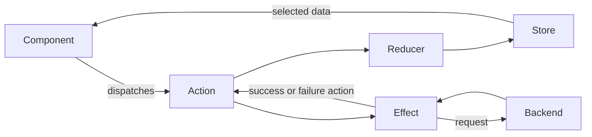

# Angular Q&A - Part 6: Performance, TypeScript, State Management & Miscellaneous

> **Beginner goal:** Understand each topic in simple words, see a small example, and learn how to explain it in an interview.

## Question Index

### Performance & Best Practices

1. [How do you optimize Angular application performance?](#how-do-you-optimize-angular-application-performance)
2. [What is OnPush change detection strategy?](#what-is-onpush-change-detection-strategy)
3. [How do you implement lazy loading?](#how-do-you-implement-lazy-loading)
4. [What are the best practices for Angular development?](#what-are-the-best-practices-for-angular-development)
5. [How do you handle memory leaks in Angular?](#how-do-you-handle-memory-leaks-in-angular)
6. [What is tree-shaking?](#what-is-tree-shaking)
7. [How do you reduce bundle size?](#how-do-you-reduce-bundle-size)

### TypeScript & Angular

8. [What TypeScript features are important for Angular?](#what-typescript-features-are-important-for-angular)
9. [What are interfaces and when to use them?](#what-are-interfaces-and-when-to-use-them)
10. [What are generics in TypeScript?](#what-are-generics-in-typescript)

### State Management

11. [How do you manage state in Angular applications?](#how-do-you-manage-state-in-angular-applications)
12. [What is NgRx? When would you use it?](#what-is-ngrx-when-would-you-use-it)
13. [What are Actions, Reducers, Effects, and Selectors in NgRx?](#what-are-actions-reducers-effects-and-selectors-in-ngrx)

### Miscellaneous

14. [What is Angular CLI?](#what-is-angular-cli)
15. [How do you build an Angular application for production?](#how-do-you-build-an-angular-application-for-production)
16. [What is environment.ts?](#what-is-environmentts)
17. [What are Angular schematics?](#what-are-angular-schematics)
18. [How do you handle internationalization (i18n)?](#how-do-you-handle-internationalization-i18n)
19. [What is the difference between ng serve and ng build?](#what-is-the-difference-between-ng-serve-and-ng-build)
20. [How do you debug Angular applications?](#how-do-you-debug-angular-applications)

## How to Use This Guide

For each question:

1. Read the simple meaning.
2. Understand the small example.
3. Review when to use it and what mistakes to avoid.
4. Practice the short interview answer in your own words.

---

## Performance & Best Practices

### How do you optimize Angular application performance?

**Simple meaning:** Performance means making the application load quickly and respond smoothly.

There are three areas to check:

- **Loading:** How long the app takes to open.
- **Screen updates:** How quickly the page reacts to clicks and data changes.
- **Network:** How quickly API data, images, and other files load.

Do not guess which optimization is needed. First measure the problem with Angular DevTools, Lighthouse, or the browser's Network and Performance tools.

**Useful techniques:**

- Lazy-load pages that are not needed at startup.
- Use `OnPush` to avoid unnecessary component checks.
- Use signals or the `async` pipe for changing data.
- Track list items by a unique ID.
- Use `@defer` for large content that appears later.
- Use virtual scrolling for very long lists.
- Compress and lazy-load images.
- Avoid slow calculations inside templates.

```typescript
export const routes: Routes = [
  {
    path: "users",
    loadComponent: () =>
      import("./users/user-list.component").then(
        (module) => module.UserListComponent,
      ),
  },
];
```

```html
@for (user of users(); track user.id) {
  <app-user-row [user]="user" />
}

@defer (on viewport) {
  <app-report-chart />
} @placeholder {
  <p>Loading chart...</p>
}
```

**Simple process:** Reproduce the slowdown, measure it, make one targeted change, and measure again.

**Interview answer:**

> I first measure whether the problem is loading, rendering, or network speed. I then use a suitable solution such as lazy loading, `OnPush`, tracked lists, optimized images, or API caching, and measure again.

---

### What is OnPush change detection strategy?

**Simple meaning:** Angular change detection checks component data and updates the screen. `OnPush` helps Angular skip a component when nothing important has changed.

An `OnPush` component is checked when:

- It receives a new input value or object reference.
- An event happens inside it, such as a button click.
- A signal used by its template changes.
- An observable used with the `async` pipe emits a value.
- Code calls `markForCheck()` or `detectChanges()`.

```typescript
@Component({
  selector: "app-counter",
  changeDetection: ChangeDetectionStrategy.OnPush,
  template: `
    <p>Count: {{ count() }}</p>
    <button (click)="increment()">Add</button>
  `,
})
export class CounterComponent {
  readonly count = signal(0);

  increment(): void {
    this.count.update((value) => value + 1);
  }
}
```

**Important rule:** When changing an input object, create a new object instead of changing the old object directly.

```typescript
// Bad: the object reference stays the same.
this.user.name = "Asha";

// Good: this creates a new object reference.
this.user = { ...this.user, name: "Asha" };
```

**Interview answer:**

> `OnPush` improves performance by allowing Angular to skip components whose relevant data has not changed. It works best with immutable updates, signals, and the `async` pipe.

---

### How do you implement lazy loading?

**Simple meaning:** Lazy loading downloads a page's code only when the user opens that page. This makes the first load smaller and faster.

**Lazy-load one standalone component:**

```typescript
import { Routes } from "@angular/router";

export const routes: Routes = [
  {
    path: "users",
    loadComponent: () =>
      import("./users/user-list.component").then(
        (module) => module.UserListComponent,
      ),
  },
];
```

**Lazy-load a group of routes:**

```typescript
export const routes: Routes = [
  {
    path: "admin",
    loadChildren: () =>
      import("./admin/admin.routes").then((module) => module.ADMIN_ROUTES),
  },
];
```

The dynamic `import()` tells the build tool to create a separate JavaScript file for that feature.

- **Lazy loading** waits until the user visits the route.
- **Preloading** downloads lazy routes quietly after the app starts.

**How to test it:** Open the browser Network panel and visit the lazy route. A new JavaScript chunk should load at that moment.

**Interview answer:**

> I use `loadComponent` for a standalone component or `loadChildren` for a group of routes. This reduces the initial bundle because feature code is downloaded only when needed.

---

### What are the best practices for Angular development?

**Simple meaning:** Best practices are common rules that make an Angular app easier to understand, test, and maintain.

**Beginner checklist:**

- Enable TypeScript `strict` mode and Angular strict template checking.
- Prefer standalone components for new applications.
- Keep each component focused on one job.
- Put shared API or business logic in services.
- Use dependency injection instead of creating services with `new`.
- Keep state close to the components that need it.
- Use signals for simple local state.
- Use RxJS for asynchronous streams and complex events.
- Use reactive forms for large or complex forms.
- Show loading, empty, success, and error states.
- Lazy-load large features.
- Write tests for important behavior.
- Never put secrets in frontend source code.

**Modern subscription cleanup:**

```typescript
import { DestroyRef, inject } from "@angular/core";
import { takeUntilDestroyed } from "@angular/core/rxjs-interop";

export class UserComponent {
  private readonly destroyRef = inject(DestroyRef);

  loadUsers(): void {
    this.userService
      .getUsers()
      .pipe(takeUntilDestroyed(this.destroyRef))
      .subscribe((users) => console.log(users));
  }
}
```

**Common mistakes:** Using `any` everywhere, calling slow methods from templates, nesting subscriptions, and making one component responsible for too many tasks.

**Interview answer:**

> I use strict typing, small focused components, dependency injection, clear state ownership, lazy-loaded routes, safe subscription cleanup, and focused tests.

---

### How do you handle memory leaks in Angular?

**Simple meaning:** A memory leak happens when the browser keeps data or a component in memory even though it is no longer needed.

Common causes are subscriptions, timers, event listeners, and WebSocket connections that remain active after a component is destroyed.

**Preferred subscription pattern:**

```typescript
export class NotificationsComponent {
  private readonly destroyRef = inject(DestroyRef);

  constructor(notifications: NotificationService) {
    notifications.messages$
      .pipe(takeUntilDestroyed(this.destroyRef))
      .subscribe((message) => console.log(message));
  }
}
```

**Timer cleanup:**

```typescript
export class ClockComponent implements OnDestroy {
  private readonly timerId = window.setInterval(() => {
    console.log(new Date());
  }, 1000);

  ngOnDestroy(): void {
    window.clearInterval(this.timerId);
  }
}
```

Manual cleanup is usually not needed for:

- `HttpClient` requests, because they normally complete after one response.
- The `async` pipe, because Angular unsubscribes automatically.
- `toSignal()`, when it uses the normal Angular injection context.

**How to find a leak:** Open and close the same page many times. Use the browser Memory panel to see whether old component instances keep increasing.

**Interview answer:**

> I prevent memory leaks by cleaning up long-running subscriptions, timers, event listeners, and external resources. For observables, I prefer the `async` pipe or `takeUntilDestroyed`.

---

### What is tree-shaking?

**Simple meaning:** Tree shaking removes code that the application never uses from the final production bundle.

For example, if a library exports 20 functions but the app uses only one, the build tool may remove the unused functions.

```typescript
import { format } from "date-fns";

console.log(format(new Date(), "yyyy-MM-dd"));
```

Tree shaking works best when:

- Code uses standard `import` and `export` statements.
- Libraries are built in a format the build tool understands.
- Modules do not run unnecessary code when imported.
- Imports use suitable package entry points.

**Do not confuse these terms:**

- **Tree shaking:** Removes unused code.
- **Lazy loading:** Moves used code into a file that loads later.
- **Minification:** Makes the remaining code shorter.

**Interview answer:**

> Tree shaking is a build optimization that removes unused code. It helps reduce production bundle size and works best with ES modules and code without unnecessary side effects.

---

### How do you reduce bundle size?

**Simple meaning:** The bundle contains the JavaScript, CSS, and other files sent to the browser. Smaller initial files normally help the app start faster.

First, create a production build with statistics:

```bash
ng build --configuration production --stats-json
```

**Ways to reduce size:**

1. Lazy-load large routes and optional components.
2. Remove packages that are not used.
3. Replace very large packages with smaller choices when appropriate.
4. Import only the parts of a package that are needed.
5. Compress images and use formats such as WebP or AVIF.
6. Remove unused fonts, locales, and polyfills.
7. Enable Brotli or gzip compression on the server.
8. Set bundle budgets so CI reports unexpected growth.

```json
{
  "type": "initial",
  "maximumWarning": "500kB",
  "maximumError": "1MB"
}
```

Compression reduces download size, but the browser must still parse and run the JavaScript. Removing unused code is better than only compressing it.

**Interview answer:**

> I analyze a production build, then use lazy loading, tree shaking, smaller dependencies, optimized assets, and bundle budgets. I compare bundle sizes and load performance after the changes.

---

## TypeScript & Angular

### What TypeScript features are important for Angular?

**Simple meaning:** TypeScript is JavaScript with type checking. It catches many mistakes while writing code, before the browser runs the app.

**Important features:**

- **Type inference:** TypeScript can often understand a type automatically.
- **Interfaces:** Describe the shape of an object.
- **Union types:** Limit a value to a small set of choices.
- **Generics:** Keep type information in reusable code.
- **Access modifiers:** Control access with `public`, `private`, and `protected`.
- **Optional chaining:** Safely access a value that may be missing.
- **Nullish coalescing:** Provide a fallback for `null` or `undefined`.
- **Decorators:** Give Angular information about components and services.
- **Utility types:** Build a new type from an existing type.

```typescript
type LoadState = "idle" | "loading" | "success" | "error";

interface User {
  readonly id: number;
  name: string;
  email?: string;
}

const state: LoadState = "loading";
const email = user.email ?? "Not provided";
```

Use `unknown` instead of `any` for a value whose type is not known. `unknown` forces you to check the value before using it.

```typescript
function getErrorMessage(error: unknown): string {
  if (error instanceof Error) {
    return error.message;
  }

  return "An unknown error occurred";
}
```

**Interview answer:**

> Angular uses TypeScript for components, services, forms, inputs, outputs, and API models. Important features include interfaces, unions, generics, decorators, access modifiers, and strict null checking.

---

### What are interfaces and when to use them?

**Simple meaning:** An interface describes what properties and methods an object must have. It is a rule for the object's shape.

```typescript
interface User {
  id: number;
  name: string;
  email?: string;
}

const user: User = {
  id: 1,
  name: "Asha",
};
```

Here, `id` and `name` are required. The `?` makes `email` optional.

**Extending an interface:**

```typescript
interface Person {
  name: string;
}

interface Employee extends Person {
  employeeId: number;
}
```

**Use interfaces for:**

- API response models.
- Component input values.
- Function parameters.
- Service contracts.
- Objects such as users, orders, and products.

**Interface versus type:**

- An `interface` is a good choice for object shapes that may be extended.
- A `type` is useful for unions, tuples, and combinations of types.

```typescript
type UserStatus = "active" | "disabled";
```

An interface checks code during development. It does not validate API data while the app is running.

**Interview answer:**

> An interface defines the expected shape of an object. I use it for models, component inputs, function arguments, and service contracts. It provides compile-time checking but no runtime validation.

---

### What are generics in TypeScript?

**Simple meaning:** A generic is a type placeholder. It allows the same code to work with different types without losing type safety.

```typescript
function first<TItem>(items: TItem[]): TItem | undefined {
  return items[0];
}

const firstName = first(["Asha", "Ben"]); // string | undefined
const firstNumber = first([10, 20]); // number | undefined
```

`TItem` means "the type of item given by the caller."

**Common Angular examples:**

```typescript
const users$: Observable<User[]> = this.userService.getUsers();
const nameControl = new FormControl<string>("");
const user$ = this.http.get<User>("/api/users/1");
```

**Generic API response:**

```typescript
interface ApiResponse<TData> {
  data: TData;
  requestId: string;
}

getUsers(): Observable<ApiResponse<User[]>> {
  return this.http.get<ApiResponse<User[]>>("/api/users");
}
```

**Generic constraint:** A constraint says that the type must contain certain properties.

```typescript
interface HasId {
  id: number;
}

function findById<TItem extends HasId>(
  items: TItem[],
  id: number,
): TItem | undefined {
  return items.find((item) => item.id === id);
}
```

**Interview answer:**

> Generics let reusable code work with different types while keeping type information. Angular uses them in APIs such as `Observable<T>`, `HttpClient.get<T>()`, and `FormControl<T>`.

---

## State Management

### How do you manage state in Angular applications?

**Simple meaning:** State is data that can change and affect the screen. Examples include the logged-in user, selected tab, cart items, and loading status.

Use the simplest option that fits the need:

1. **Component signal:** State is used by one component.
2. **Inputs and outputs:** A parent shares state with child components.
3. **Service with signals or RxJS:** Several components share state.
4. **Router:** The value belongs in the URL, such as a filter or selected ID.
5. **NgRx:** Many features share complex state and events.
6. **Backend:** Server data remains the main source of truth.

**Local state:**

```typescript
export class CounterComponent {
  readonly count = signal(0);
  readonly doubled = computed(() => this.count() * 2);

  increment(): void {
    this.count.update((value) => value + 1);
  }
}
```

**Shared state service:**

```typescript
@Injectable({ providedIn: "root" })
export class CartState {
  private readonly itemsState = signal<CartItem[]>([]);

  readonly items = this.itemsState.asReadonly();
  readonly total = computed(() =>
    this.items().reduce(
      (sum, item) => sum + item.price * item.quantity,
      0,
    ),
  );

  add(item: CartItem): void {
    this.itemsState.update((items) => [...items, item]);
  }
}
```

The writable signal is private, so components must use the service's methods. The total is calculated from the items instead of being stored separately.

- Signals are simple for current values and calculated UI state.
- RxJS is useful for API calls and event streams that need cancellation, retry, delay, or combination.

**Interview answer:**

> I keep state as close as possible to where it is used. I start with component signals, move shared state into a service, use the URL for navigation state, and choose NgRx only when application-wide state becomes complex.

---

### What is NgRx? When would you use it?

**Simple meaning:** NgRx is a state management library for Angular. It gives large applications a clear and predictable way to change shared state.



**Main parts:**

- **Store:** Holds application state.
- **Action:** Describes an event that happened.
- **Reducer:** Creates the next state.
- **Effect:** Handles API calls and other external work.
- **Selector:** Reads or calculates data from the store.

**Use NgRx when:**

- Many distant features use the same state.
- State can change in many different ways.
- Business events must be easy to trace.
- API workflows need consistent cancellation or retry rules.
- The team benefits from Redux DevTools and strict patterns.

Do not use NgRx only because an app is called "enterprise." For a small feature, a service with signals may be easier to understand.

**Interview answer:**

> NgRx is an Angular state management library based on Redux ideas. I use it when shared state and business events are complex enough to benefit from actions, reducers, effects, selectors, and debugging tools.

---

### What are Actions, Reducers, Effects, and Selectors in NgRx?

**Simple meaning:** Each NgRx part has one job.

- **Action:** Says what happened.
- **Reducer:** Decides how state changes.
- **Effect:** Performs external work, such as an API call.
- **Selector:** Reads data from the store.

**Actions:**

```typescript
export const loadUsers = createAction("[Users Page] Load Users");

export const loadUsersSuccess = createAction(
  "[Users API] Load Users Success",
  props<{ users: User[] }>(),
);

export const loadUsersFailure = createAction(
  "[Users API] Load Users Failure",
  props<{ error: string }>(),
);
```

**Reducer:**

```typescript
export interface UserState {
  users: User[];
  loading: boolean;
  error: string | null;
}

const initialState: UserState = {
  users: [],
  loading: false,
  error: null,
};

export const userReducer = createReducer(
  initialState,
  on(loadUsers, (state) => ({ ...state, loading: true, error: null })),
  on(loadUsersSuccess, (state, { users }) => ({
    ...state,
    users,
    loading: false,
  })),
  on(loadUsersFailure, (state, { error }) => ({
    ...state,
    error,
    loading: false,
  })),
);
```

A reducer must not change the old state directly. It returns a new object.

**Effect:**

```typescript
export class UserEffects {
  loadUsers$ = createEffect(() =>
    this.actions$.pipe(
      ofType(loadUsers),
      switchMap(() =>
        this.userService.getUsers().pipe(
          map((users) => loadUsersSuccess({ users })),
          catchError((error) =>
            of(loadUsersFailure({ error: error.message })),
          ),
        ),
      ),
    ),
  );

  constructor(
    private readonly actions$: Actions,
    private readonly userService: UserService,
  ) {}
}
```

**Selectors:**

```typescript
export const selectUserState = (state: AppState) => state.users;

export const selectUsers = createSelector(
  selectUserState,
  (state) => state.users,
);

export const selectLoading = createSelector(
  selectUserState,
  (state) => state.loading,
);
```

**Complete flow:**

1. A component dispatches `loadUsers`.
2. The reducer sets `loading` to `true`.
3. The effect calls the API.
4. The effect dispatches a success or failure action.
5. The reducer updates the state.
6. Selectors send the new values to the component.

**Interview answer:**

> Actions describe events, reducers create new state, effects handle external work, and selectors read or derive state. Together they create a predictable one-way data flow.

---

## Miscellaneous

### What is Angular CLI?

**Simple meaning:** Angular CLI is the official command-line tool for creating, running, testing, building, and updating Angular projects. CLI means **Command-Line Interface**.

```bash
# Create a project
ng new customer-portal

# Run the development server
ng serve

# Generate code
ng generate component users/user-card
ng generate service users/user
ng generate guard auth

# Build and test
ng build
ng test

# Show versions and update Angular
ng version
ng update @angular/core @angular/cli
```

Short forms such as `ng g c user-card` also work, but full command names are easier for beginners to remember.

**Important files:**

- `angular.json`: Build options, assets, styles, and project settings.
- `package.json`: Dependencies and scripts.
- `tsconfig.json`: TypeScript settings.

Use `npx ng` when you want to run the CLI version installed in the current project.

**Interview answer:**

> Angular CLI is the official tool used to create, generate, serve, test, build, and update Angular applications. It also manages the standard Angular build configuration.

---

### How do you build an Angular application for production?

**Simple meaning:** A production build creates optimized files that can be deployed to a web server.

```bash
ng build --configuration production
```

The output is normally written inside the `dist/` folder.

A production build normally includes:

- Ahead-of-time template compilation.
- Minified JavaScript and CSS.
- Tree shaking.
- Code splitting.
- Hashed filenames for browser caching.

**Before deployment:**

1. Run tests and linting.
2. Create the production build.
3. Fix bundle budget warnings or errors.
4. Check public environment settings.
5. Deploy the generated files.
6. Configure the server to return `index.html` for Angular routes.
7. Enable HTTPS and compression.

`ng serve` is only a development server. Do not use it to host a production app.

**Interview answer:**

> I use `ng build --configuration production`, verify tests and bundle budgets, and deploy the generated output from `dist/`. The production server also needs HTTPS, compression, caching, and SPA route fallback.

---

### What is environment.ts?

**Simple meaning:** An environment file stores public settings that can be different for development and production builds.

```typescript
// environment.ts
export const environment = {
  production: false,
  apiUrl: "http://localhost:3000",
};
```

```typescript
// environment.production.ts
export const environment = {
  production: true,
  apiUrl: "https://api.example.com",
};
```

Use the value in application code:

```typescript
this.http.get(`${environment.apiUrl}/users`);
```

The selected build configuration can replace one environment file with another. Modern Angular can create the setup with:

```bash
ng generate environments
```

**Security warning:** Everything in an Angular bundle can be seen by users. Never store passwords, private keys, database connection strings, or client secrets in an environment file.

Environment values are fixed when the app is built. Use public runtime configuration when the same build must run in several environments.

**Interview answer:**

> Environment files hold public build-specific settings such as an API URL. Angular can replace them for different configurations, but they must never contain secrets because frontend code is visible to users.

---

### What are Angular schematics?

**Simple meaning:** A schematic is a code generator that creates or updates project files by following a set of rules.

For example:

```bash
ng generate component users/user-card
```

This command uses a component schematic to create files with the project's naming and style settings.

**Common uses:**

- Generate components, services, guards, pipes, and other Angular code.
- Add and configure a library with `ng add`.
- Update old code during `ng update`.
- Apply the same company structure across many projects.

```bash
ng generate service users/user
ng generate guard auth
ng add @angular/material
ng update @angular/core @angular/cli
```

Schematics can change many files, so review their changes in source control.

**Interview answer:**

> Angular schematics are programs that create or change files using predefined rules. Angular CLI uses them for code generation, library setup, and framework migrations.

---

### How do you handle internationalization (i18n)?

**Simple meaning:** Internationalization prepares an application for different languages and regions. It is shortened to `i18n` because there are 18 letters between `i` and `n`.

It includes:

- Translating text.
- Formatting dates, numbers, and currencies.
- Handling singular and plural words.
- Supporting right-to-left languages.
- Allowing space for longer translated text.

**Angular's built-in process:**

1. Mark text for translation.
2. Extract the messages.
3. Translate the generated file.
4. Configure supported locales.
5. Build the localized versions.

```html
<h1 i18n="Page heading|Greeting@@homeGreeting">Hello</h1>

<p i18n>
  {itemCount, plural,
    =0 {No items}
    =1 {One item}
    other {{{itemCount}} items}
  }
</p>
```

```bash
ng extract-i18n --output-path src/locale
ng build --localize
```

Angular's built-in system usually creates a build for each language. Runtime translation libraries can change language without rebuilding, but need different setup.

**Common mistakes:** Joining translated sentence pieces, ignoring plural rules, using flags for languages, hard-coding date formats, and making buttons too small for translated text.

**Interview answer:**

> I mark translatable text, extract messages, translate them, configure locales, and build localized versions. I also localize dates, numbers, currencies, plurals, and layout direction.

---

### What is the difference between ng serve and ng build?

**Simple meaning:** `ng serve` is for active development. `ng build` creates files for deployment.

**`ng serve`:**

- Builds the app and starts a local server.
- Watches files for changes.
- Refreshes the browser after edits.
- Keeps running until stopped.

```bash
ng serve
ng serve --port 4300
```

**`ng build`:**

- Builds without starting a web server.
- Writes files to `dist/`.
- Runs once and exits, unless watch mode is enabled.
- Can use development or production settings.

```bash
ng build --configuration production
ng build --configuration development --watch
```

Do not memorize that one always uses JIT and the other always uses AOT. Compilation behavior depends on the project's configuration.

**Interview answer:**

> `ng serve` provides a local development server and watches for source changes. `ng build` creates output files in `dist/` for deployment or testing without hosting them.

---

### How do you debug Angular applications?

**Simple meaning:** Debugging means finding the real cause of a problem and fixing it. Change one thing at a time so each test gives a clear answer.

**A simple debugging process:**

1. Reproduce the issue using exact steps.
2. Read the first useful error and its stack trace.
3. Decide whether the issue is in the UI, state, route, form, API, or build.
4. Inspect the smallest related component or service.
5. Think of one possible cause.
6. Test it with a breakpoint, log, Network panel, or focused test.
7. Fix the cause and add a test when useful.

**Choose a tool based on the problem:**

- Wrong component data: Angular DevTools or a breakpoint.
- Failed API request: Browser Network panel.
- Observable problem: `tap`, error handlers, and subscription checks.
- Routing problem: Router events, route order, guards, and URL values.
- Slow screen: Angular DevTools Profiler and Performance panel.
- Memory growth: Browser Memory panel.
- Production-only error: Test a production build and check deployment settings.

```typescript
this.userService
  .getUsers()
  .pipe(
    tap((users) => console.log("Users received", users)),
    catchError((error) => {
      console.error("Loading users failed", error);
      return of([]);
    }),
  )
  .subscribe();
```

Remove temporary logs and `debugger` statements after finding the problem. Do not use `ApplicationRef.tick()` as a normal fix because it can hide the real change-detection issue.

**Interview answer:**

> I reproduce the issue, read the first useful error, narrow it to one area, form one possible cause, and test it with the right tool. I fix the root cause and add a regression test when practical.
